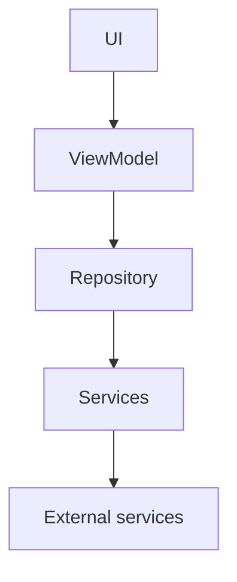

---
# Apresentação do Projeto

Este projeto utiliza o App Architecture, a nova arquitetura de software recomendada pela equipe do Google/Flutter. O objetivo é garantir uma estrutura escalável, testável e de fácil manutenção para aplicações Flutter.

## Fonte única da verdade

No contexto desta arquitetura, o **Repository** atua como nossa fonte única da verdade. Ele é responsável por centralizar o acesso e gerenciamento dos dados, seja localmente ou remotamente, garantindo que toda a aplicação trabalhe com informações consistentes e atualizadas.

## Fluxo de Dados



Neste fluxo, a interface do usuário (UI) interage com o ViewModel, que por sua vez acessa o Repository. O Repository comunica-se com os Services, que realizam operações e acessam serviços externos conforme necessário.


## Exemplos de implementação de Repository

### Exemplo de Repository (Abstract)

```dart
import 'package:flutter/material.dart';
import 'package:turma_02/domain/dtos/create_product_dto.dart';
import 'package:turma_02/domain/models/product_model.dart';
import 'package:turma_02/utils/result.dart';

abstract class ProductRepository extends ChangeNotifier {
  List<ProductModel> get products;
  Future<Result<List<ProductModel>>> get();
  Future<Result<ProductModel>> create(CreateProductDto product);
  Future<Result<void>> delete(ProductModel product);
}
```

### Exemplo de Repository Remote (implementação)

```dart
import 'package:flutter/material.dart';
import 'package:turma_02/data/repositories/product/product_repository.dart';
import 'package:turma_02/data/services/api_client.dart';
import 'package:turma_02/data/services/models/products/create_product_request.dart';
import 'package:turma_02/data/services/models/products/product_api_model.dart';
import 'package:turma_02/domain/dtos/create_product_dto.dart';
import 'package:turma_02/domain/models/product_model.dart';
import 'package:turma_02/utils/result.dart';

class ProductRepositoryRemote extends ChangeNotifier
    implements ProductRepository {
  final ApiClient _apiClient;

  @override
  List<ProductModel> get products => _products;
  List<ProductModel> _products = [];

  ProductRepositoryRemote(this._apiClient);

  @override
  Future<Result<ProductModel>> create(CreateProductDto product) async {
    try {
      final result = await _apiClient.create(CreateProductRequest(nome: product.name, categoryId: product.categoryId, price: product.price));
      switch (result) {
        case Ok<ProductApiModel>():
          final product = ProductModel(id: result.value.id, name: result.value.nome, categoryId: result.value.categoryId, price: result.value.price);
          _products.add(product);
          return Result.ok(product);
        case Error():
          return Result.error(result.error);
      }
    } on Exception catch (error) {
      return Result.error(error);
    } finally {
      notifyListeners();
    }
  }

  @override
  Future<Result<void>> delete(ProductModel product) async {
    try {
      final result = await _apiClient.delete(product);
      switch (result) {
        case Ok<void>():
          _products.remove(product);
          return Result.ok(null);
        default:
          return result;
      }
    } on Exception catch (error) {
      return Result.error(error);
    } finally {
      notifyListeners();
    }
  }

  @override
  Future<Result<List<ProductModel>>> get() async {

    final result = await _apiClient.get();
      switch (result) {
        case Ok<List<ProductApiModel>>():
        final products = result.value.map((e) => ProductModel(id: e.id, name: e.nome,categoryId: e.categoryId,  price: e.price)).toList();
        _products = products;
        return Result.ok(products);
      case Error():
        return Result.error(result.error);
      }
  }
}
```
